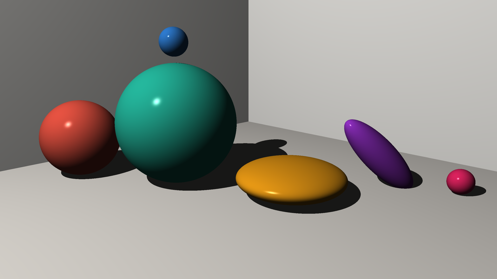

# Ray Tracer

This is a C++ implementation of a 3D Ray tracer, built from scratch following test-driven development principles.

## Overview

This project simulates light rays to render 3D scenes. It's built for performance and educational purposes, adhering strictly to modern C++ standards.

> Six spheres, each transformed with a different 4×4 matrix operation (translation, uniform scale, non-uniform scale, rotation, combined transforms, and scale-down), rendered at QHD (2560×1440) with Phong shading and hard shadows.  
> All rendered examples are collected in the [`renders/`](renders/) folder.

## Documentation

Documentation of this project is structured using the [Diátaxis framework](https://diataxis.fr/).

- **Tutorial**: A step-by-step guide to build and run the Ray tracer.
    - [Getting Started](documentation/tutorials/GettingStarted.md)
    - [Environment Setup](documentation/tutorials/EnvironmentSetup.md)
    - [Multithreading Guide](documentation/tutorials/MultithreadingGuide.md)
- **How-To Guides**: Practical guides for specific tasks.
    - [Run Tests](documentation/how-to/RunTests.md)
    - [Write Tests](documentation/how-to/WriteTests.md)
    - [Profile Code](documentation/how-to/ProfileCode.md)
    - [Add a New Primitive](documentation/how-to/AddNewPrimitive.md)
- **References**: Technical descriptions of the underlying APIs, code style, and mathematical structures.
    - [Core Mathematics](documentation/references/CoreMath.md)
    - [C++ Implementation Details](documentation/references/C++ImplementationDetails.md)
    - [C++ Module & Build Architecture](documentation/references/C++Architecture.md)
    - [Docstring Guidelines](documentation/references/DocstringGuidelines.md)
- **Explanation**: High-level architectural overview and explanations of algorithms and concepts used.
    - [Architecture](documentation/explanation/Architecture.md)
    - [Ray-Sphere Intersection](documentation/explanation/RaySphereIntersectionAlgorithm.md)
    - [Ray-Plane Intersection](documentation/explanation/RayPlaneIntersectionAlgorithm.md)
    - [Phong Reflection Model](documentation/explanation/PhongReflectionModel.md)
    - [Data-Oriented Design (DOD)](documentation/explanation/DataOrientedDesign.md)
    - [View Transformation](documentation/explanation/ViewTransformation.md)
    - [Camera & Perspective Projection](documentation/explanation/Camera.md)
    - [Shadows & Self-Shadowing (Acne)](documentation/explanation/Shadows.md)

## Visualizer Demos

The project includes a suite of example programs in `visualizers/` ordered by increasing complexity. Rendered output images are collected in `renders/`.

1. **`1.ProjectTrajectory`**: Plots a 2D projectile path under gravity and wind forces onto a canvas.
2. **`2.ClockMarkers`**: Draws twelve clock-hour markers using 2D rotation transformation matrices.
3. **`3.SphereRayCast`**: Renders a raw ray-cast silhouette of a sphere — showcasing the fundamental intersection algorithm with no shading.
4. **`4.SpherePhongReflection`**: A single sphere shaded with the full Phong reflection model, resting on an infinite floor plane.
5. **`5.MultipleSpherePhongReflections`**: Three spheres of different sizes and materials shaded under Phong lighting, resting on an infinite floor plane.
6. **`6.FirstScene`**: A full perspective-camera scene featuring three spheres casting shadows onto an infinite floor plane and two angled wall planes, rendered at QHD (2560×1440).
7. **`7.MatrixTransformations`**: Six spheres each transformed with a different 4×4 matrix operation (translation, uniform scale, non-uniform scale, rotation, combined, scale-down) in a single scene with floor and wall planes.

## Contributing

Contributions are welcome! Please refer to [CONTRIBUTING.md](CONTRIBUTING.md) for detailed guidelines.

## Tech Stack
- **Language**: C++23
- **Build System**: CMake (3.28+) and Ninja
- **Testing**: GoogleTest (gTest)
- (Optional) **Multithreading**: OpenMP (libomp)
