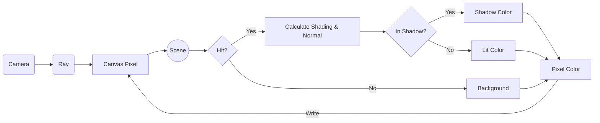

# Explanation: Ray Tracing Architecture

This section explains the core conceptual model of how the Ray tracer generates an image. Unlike rasterization (the technique used in most real-time games), which projects 3D triangles onto a 2D screen, Ray tracing works backwards from the camera.

## The Conceptual Model

In the real world, light sources emit photons that bounce off objects and eventually hit our eyes (or a camera lens). Ray tracing simulates this by shooting "rays" *out* of the camera, through a virtual "Canvas" (the screen), and into the 3D scene to see what they hit.

### The Rendering Pipeline

The following diagram illustrates the high-level architecture and workflow of our Ray tracer for a single pixel.

### 1. Generating Rays
For every pixel on our `Canvas`, the `Camera` generates a `Ray`. A Ray consists of an origin (the camera's position) and a direction (pointing towards the specific pixel on the Canvas).

### 2. Intersection Testing
The engine iterates through all objects in the `Scene` (like spheres or planes). It uses mathematical formulas to determine if the `Ray` intersects with the geometry of the object. If a Ray hits multiple objects, we only care about the *closest* Intersection, as that object blocks the ones behind it.

### 3. Shading and Lighting
Once a hit is confirmed, we need to determine the Color of that pixel. This involves:
- **Surface Normal:** Calculating the perpendicular Vector at the Point of Intersection.
- **Material:** Checking the object's Color, shininess, and reflectiveness.
- **Lighting Model:** We use the Phong reflection model, which combines ambient, diffuse, and specular lighting based on the position of the light source(s).
- **Shadows:** We cast a *secondary* Ray from the Intersection Point towards the light source. If this Ray hits an object before reaching the light, the original Point is in shadow.

### 4. Writing to Canvas
The final computed Color is written to the corresponding pixel on the `Canvas`. Once all pixels are calculated, the Canvas is exported as an image file.

---

## See Also

- For detailed information on the C++20 module layout, build files, and dependency graph, refer to the **[C++ Module & Dependency Architecture Reference](../references/C++Architecture.md)**.
- For information on code optimization, cache line utility, and our packed pixel grid design, see the **[Data-Oriented Design Explanation](DataOrientedDesign.md)**.
