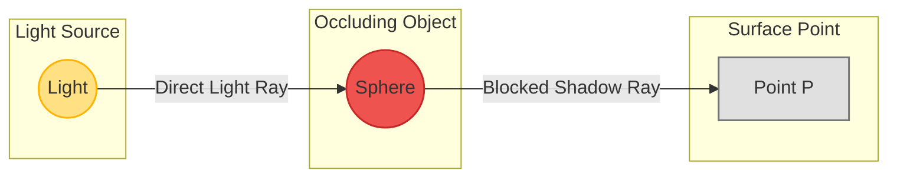
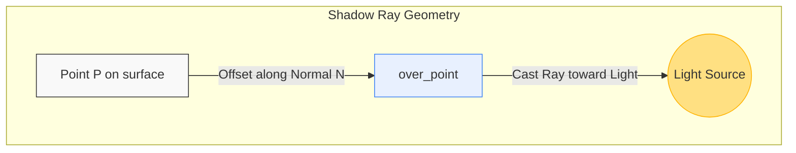

# Explanation: Shadows & Self-Shadowing (Shadow Acne)

This document explains the mathematical and physical model used to render shadows, as well as the implementation details to prevent floating-point self-shadowing artifacts (shadow acne).

---

## 1. Physical Concept of Shadow Rays

In ray tracing, a point on a surface is illuminated by a light source if there is an unobstructed line of sight between them. To determine this visibility, we cast a **shadow ray** from the intersection point on the surface back toward the light source.

*   **Unshadowed Point:** The shadow ray travels directly to the light source without hitting any opaque geometry.
*   **Shadowed Point:** The shadow ray intersects another object in the scene before reaching the light source, meaning the light source is blocked.

---

## 2. Mathematical Model

For any shaded point $P$ and a point light source located at $L$:

1.  **Light Vector ($\vec{v}$):** The offset vector from the surface point $P$ to the light source $L$:
    $$\vec{v} = L - P$$

2.  **Distance ($d$):** The Euclidean distance to the light source (the magnitude of $\vec{v}$):
    $$d = \|\vec{v}\| = \sqrt{v_x^2 + v_y^2 + v_z^2}$$

3.  **Direction ($\vec{D}$):** The normalized direction vector pointing toward the light source:
    $$\vec{D} = \text{normalize}(\vec{v}) = \frac{\vec{v}}{\|\vec{v}\|}$$

4.  **Shadow Ray ($R_s$):** The ray cast from the point toward the light:
    $$R_s(t) = P + t\vec{D}$$

5.  **Occlusion Condition:** We test the shadow ray against all shapes in the world to find intersections. If the closest intersection $h$ satisfies:
    $$\text{EPSILON} < h.t < d$$
    then the point is obstructed and lies in shadow. If no hit occurs within this range, the point is fully illuminated.

---

## 3. Shadow Acne & The Over Point

### The Phenomenon
When calculating the intersection point $P$ of a primary ray and a shape, floating-point rounding errors are introduced. The calculated point $P$ might actually lie slightly *inside* the shape's boundary rather than exactly on its surface.

If we cast a shadow ray starting exactly at $P$, the intersection algorithm will detect that the ray immediately intersects the *same shape it is originating from* at a tiny distance $t \approx 0.000001$. Because $t > 0$ and $t < d$, the point is incorrectly flagged as being in shadow. This self-shadowing artifact is called **shadow acne** and manifests as black speckles or stripes on surface curves.

### The Solution: `over_point`
To prevent self-shadowing, we shift the starting position of the shadow ray slightly outwards along the surface normal vector $\vec{N}$ by a small value $\epsilon$ ($\text{EPSILON} = 0.0001f$).

$$P_{\text{over}} = P + \vec{N} \times \text{EPSILON}$$

We then use $P_{\text{over}}$ as the origin of our shadow ray:
$$R_s(t) = P_{\text{over}} + t\vec{D}$$

This shifts the ray origin outside the geometry boundary, ensuring it cannot intersect its own parent surface.

---

## 4. Integration with Phong Lighting

When rendering a point $P$, we query the shadow state:
$$\text{shadowed} = \text{isShadowed}(World, P_{\text{over}})$$

If `shadowed` is **true**:
*   The diffuse and specular lighting components of the Phong model are completely ignored (set to 0).
*   Only the ambient component is evaluated.

$$\text{Color} = \text{Color}_{\text{ambient}} = \text{effectiveColor} \times \text{material.ambient}$$

If `shadowed` is **false**:
*   The point receives ambient, diffuse, and specular illumination.

$$\text{Color} = \text{Color}_{\text{ambient}} + \text{Color}_{\text{diffuse}} + \text{Color}_{\text{specular}}$$
