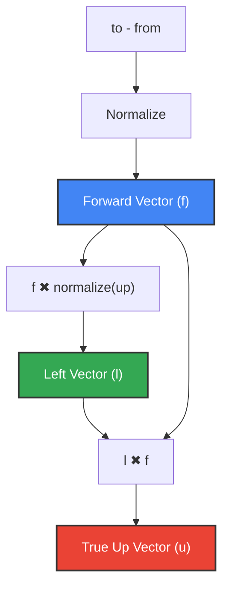

# Explanation: The View Transformation Matrix

The **View Transformation** is a fundamental operation in 3D graphics and ray tracing. It transforms the coordinates of objects in the scene from **World Space** to **Camera Space** (also known as **View Space**).

Mathematically, this transformation aligns the virtual camera's position and orientation with the standard coordinate axes, placing the camera at the origin $(0, 0, 0)$ looking straight down the negative $Z$-axis.

---

## The Philosophy of "Moving the World"

In computer graphics, a virtual camera does not actually move. Instead, to achieve the illusion of looking at a scene from a specific position and angle:
*   We apply a transformation that **shifts and rotates the entire world in the opposite direction**.
*   If the camera moves $10$ units to the right, we translate the entire world $10$ units to the left.
*   If the camera rotates $30^\circ$ to the left, we rotate the entire world $30^\circ$ to the right.

By doing this, the camera remains the center of the universe at $(0, 0, 0)$, which simplifies ray generation and perspective calculations.

---

## The Inputs

To orient a camera arbitrarily in space, we require three parameters:
1.  **`from`** (Point): The 3D position where the camera is located in world space.
2.  **`to`** (Point): The target point in world space that the camera is looking at.
3.  **`up`** (Vector): An approximate direction indicating which way is "up" for the camera (usually $\vec{Y} = [0, 1, 0]$).

---

## Constructing the Orthonormal Basis

Using these three inputs, we compute three mutually perpendicular (orthogonal) unit vectors ($\vec{left}$, $\vec{up}_{\text{true}}$, and $\vec{forward}$) to define the camera's local coordinate system.



### 1. The Forward Vector ($\vec{forward}$)
First, we find the direction the camera is pointing by subtracting `from` from `to` and **normalizing** the result:
$$ \vec{forward} = \text{normalize}(\vec{to} - \vec{from}) $$

> [!IMPORTANT]
> Normalizing the forward vector is critical. If skipped, the subsequent cross products will carry a scaling factor proportional to the distance between the camera and target, causing the entire world to appear scaled or distorted.

### 2. The Left Vector ($\vec{left}$)
Next, we find the horizontal axis of the camera's view (pointing left) by taking the cross product of the forward direction and the normalized up vector:
$$ \vec{left} = \vec{forward} \times \text{normalize}(\vec{up}) $$

### 3. The True Up Vector ($\vec{up}_{\text{true}}$)
Finally, we compute the precise vertical axis of the camera's view. By taking the cross product of the left and forward vectors, we ensure that our final coordinate frame is perfectly perpendicular:
$$ \vec{up}_{\text{true}} = \vec{left} \times \vec{forward} $$

---

## Structuring the View Matrix

The final view transform matrix $V$ is computed by multiplying two distinct matrices: **Orientation** ($O$) and **Translation** ($T$).

$$ V = O \times T $$

### 1. The Orientation Matrix ($O$)
The orientation matrix rotates the world so that the camera's basis vectors ($\vec{left}$, $\vec{up}_{\text{true}}$, $-\vec{forward}$) align with the world's $X$, $Y$, and $Z$ axes respectively.

$$ O = \begin{pmatrix}
left_x & left_y & left_z & 0 \\
up_{\text{true}, x} & up_{\text{true}, y} & up_{\text{true}, z} & 0 \\
-forward_x & -forward_y & -forward_z & 0 \\
0 & 0 & 0 & 1
\end{pmatrix} $$

*(Note: We use $-forward.x, -forward.y, -forward.z$ because our camera looks down the negative $Z$-axis by convention.)*

### 2. The Translation Matrix ($T$)
The translation matrix moves the world so that the camera's `from` position is shifted exactly to the origin $(0, 0, 0)$.

$$ T = \begin{pmatrix}
1 & 0 & 0 & -from.x \\
0 & 1 & 0 & -from.y \\
0 & 0 & 1 & -from.z \\
0 & 0 & 0 & 1
\end{pmatrix} $$

---

## Code Implementation

In our transformations module, the View Transform is computed efficiently by constructing the orientation matrix and multiplying it by a standard translation matrix:

```cpp
Matrix<4> view_transform(const Point& from, const Point& to, const Vector& up)
{
    const Vector forward_v = normalizeVector(to - from);
    const Vector left_v = crossProduct(forward_v, normalizeVector(up));
    const Vector true_up = crossProduct(left_v, forward_v);

    Matrix<4> orientation;

    orientation(0, 0) = left_v.x;
    orientation(0, 1) = left_v.y;
    orientation(0, 2) = left_v.z;
    orientation(0, 3) = 0.0f;

    orientation(1, 0) = true_up.x;
    orientation(1, 1) = true_up.y;
    orientation(1, 2) = true_up.z;
    orientation(1, 3) = 0.0f;

    orientation(2, 0) = -forward_v.x;
    orientation(2, 1) = -forward_v.y;
    orientation(2, 2) = -forward_v.z;
    orientation(2, 3) = 0.0f;

    orientation(3, 0) = 0.0f;
    orientation(3, 1) = 0.0f;
    orientation(3, 2) = 0.0f;
    orientation(3, 3) = 1.0f;

    return orientation * translation(-from.x, -from.y, -from.z);
}
```
