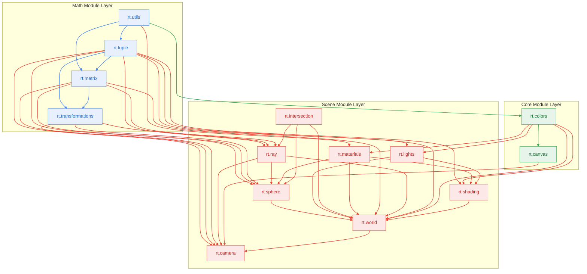

# Reference: C++ Module & Build Architecture

This reference guide documents the code-level structure of the Ray Tracer engine, focusing on its C++23 Modules architecture and module dependency graph.

---

## 1. Module Layout and Responsibilities

Our codebase is organized into modular C++23 units, split into module interfaces (`.cppm`) and module implementations (`.cpp`), categorized under subfolders `math/`, `core/`, and `scene/` under `src/`. Below is the list of exported modules, their file paths, and their responsibilities:

| Module Name | File Paths | Direct Imports | Responsibility |
| :--- | :--- | :--- | :--- |
| **`rt.utils`** | `src/math/Utils.cppm`, `.cpp` | None | Low-level utility functions (e.g., approximate equality checks). |
| **`rt.tuple`** | `src/math/Tuple.cppm`, `.cpp` | `rt.utils` | Primitives (`Tuple`, `Point`, `Vector`) and Vector operations (addition, cross/dot product, normalization, reflection). |
| **`rt.matrix`** | `src/math/Matrix.cppm` | `rt.utils`, `rt.tuple` | Template-based `Matrix<N>` definition, Matrix determinant, cofactor, submatrix, inversion, and Matrix multiplication. *(Templates remain in interface)* |
| **`rt.transformations`**| `src/math/Transformations.cppm`, `.cpp` | `rt.matrix`, `rt.tuple` | Linear transformations (translation, scale, rotation, shear, and Householder reflection matrices). |
| **`rt.colors`** | `src/core/Colors.cppm`, `.cpp` | `rt.utils` | The `Color` structure and Color blend operations. |
| **`rt.canvas`** | `src/core/Canvas.cppm`, `.cpp` | `rt.colors` | The rendering grid (`Canvas`) and export logic (PPM serialization). |
| **`rt.sphere`** | `src/scene/Sphere.cppm`, `.cpp` | `rt.tuple`, `rt.matrix`, `rt.transformations`, `rt.materials`, `rt.intersection`, `rt.ray` | Concrete `Sphere` shape definition (flat layout, no inheritance). |
| **`rt.intersection`** | `src/scene/Intersection.cppm`, `.cpp` | None | Tracking records of Ray-object intersections (t-distance, index, and shape type). |
| **`rt.ray`** | `src/scene/Ray.cppm`, `.cpp` | `rt.tuple`, `rt.intersection`, `rt.matrix`, `rt.transformations` | Cast Ray definition (`Ray`), Ray position calculations, and hit utility algorithms. |
| **`rt.lights`** | `src/scene/Lights.cppm`, `.cpp` | `rt.tuple`, `rt.colors` | Point light source definition. |
| **`rt.materials`** | `src/scene/Materials.cppm`, `.cpp` | `rt.colors`, `rt.utils` | Surface reflection material definition (ambient, diffuse, specular, shininess). |
| **`rt.shading`** | `src/scene/Shading.cppm`, `.cpp` | `rt.materials`, `rt.colors`, `rt.tuple`, `rt.lights` | Phong reflection model lighting calculations. |
| **`rt.world`** | `src/scene/World.cppm`, `.cpp` | `rt.sphere`, `rt.lights`, `rt.intersection`, `rt.materials`, `rt.matrix`, `rt.ray`, `rt.tuple`, `rt.colors` | A container `World` holding shape lists and light sources, and factory utility `default_world()`. |
| **`rt.camera`** | `src/scene/Camera.cppm`, `.cpp` | `rt.tuple`, `rt.matrix`, `rt.ray`, `rt.canvas`, `rt.world`, `rt.transformations` | Virtual pinhole camera with viewport scaling, ray generation, and OpenMP-accelerated multithreaded rendering. |

---

## 2. Module Dependency Graph

C++23 modules require a strict, acyclic compilation order. The diagram below illustrates how components import each other. Lower modules must be compiled completely before the modules importing them can compile.

### Avoiding Circular Imports
To prevent C++ compiler deadlock (cyclic dependency loops), we separate functions by their data dependencies. For example:
- **Vector reflection** (`reflect(in, normal)`) is kept in **`rt.tuple`** because it only needs basic Vector operations.
- **Matrix reflection** (`reflection(normal)`) is kept in **`rt.transformations`** because it generates a `Matrix<4>` from the Vector.

---

## 3. Build & Compilation Architecture

The project builds via **CMake (3.28+)** and the **Ninja** generator. The build tree is divided into:

1. **`raytracer_core` (Static Library)**:
   - A compiled static library containing all C++ module interfaces (`src/**/*.cppm`) and their corresponding implementations (`src/**/*.cpp`). 
   - All tests and visualizer executables link against this core library.
2. **`run_tests` (Google Test Executable)**:
   - Compiles test suites (`tests/*.t.cpp`) and links against `raytracer_core` and `googletest`.
3. **Visualizer Executables**:
   - Standalone graphic demo binaries (`1.ProjectTrajectory`, `2.ClockMarkers`, `3.ConsoleIntersectionCheck`, `4.SphereShadow`, `5.MultipleSphereShadows`, `6.SpherePhongReflection`, `7.MultipleSpherePhongReflections`, `8.FirstScene`, `9.ShadowScene`) that link against `raytracer_core`.
