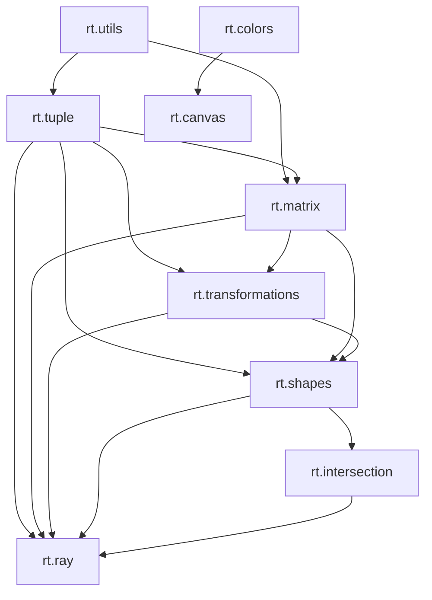

# Reference: C++ Module & Build Architecture

This reference guide documents the code-level structure of the Ray Tracer engine, focusing on its C++20 Modules architecture and module dependency graph.

## 1. Module Layout and Responsibilities

Our codebase is organized into modular C++20 units (`.cppm` files). Below is the list of exported modules and their responsibilities:

| Module Name | File Path | Direct Imports | Responsibility |
| :--- | :--- | :--- | :--- |
| **`rt.utils`** | `src/Utils.cppm` | None | Low-level utility functions (e.g., approximate equality checks). |
| **`rt.tuple`** | `src/Tuple.cppm` | `rt.utils` | Primitives (`Tuple`, `Point`, `Vector`) and Vector operations (addition, cross/dot product, normalization, reflection). |
| **`rt.colors`** | `src/Colors.cppm` | None | The `Color` structure and Color blend operations. |
| **`rt.canvas`** | `src/Canvas.cppm` | `rt.colors` | The rendering grid (`Canvas`) and export logic (PPM serialization). |
| **`rt.matrix`** | `src/Matrix.cppm` | `rt.utils`, `rt.tuple` | Template-based `Matrix<N>` definition, Matrix determinant, cofactor, submatrix, inversion, and Matrix multiplication. |
| **`rt.transformations`**| `src/Transformations.cppm` | `rt.matrix`, `rt.tuple` | Linear transformations (translation, scale, rotation, shear, and Householder reflection matrices). |
| **`rt.shapes`** | `src/Shapes.cppm` | `rt.tuple`, `rt.matrix`, `rt.transformations` | Geometric primitive models (`Sphere` struct definition, transform properties). |
| **`rt.intersection`** | `src/Intersection.cppm` | `rt.shapes` | Tracking records of Ray-object intersections (t-distance and shape pointer). |
| **`rt.ray`** | `src/Ray.cppm` | `rt.tuple`, `rt.shapes`, `rt.intersection`, `rt.matrix`, `rt.transformations` | Cast Ray definition (`Ray`), Ray position calculations, and Ray-Sphere Intersection testing algorithms. |

---

## 2. Module Dependency Graph

C++20 modules require a strict, acyclic compilation order. The diagram below illustrates how components import each other. Lower modules must be compiled completely before the modules importing them can compile.

### Avoiding Circular Imports
To prevent C++ compiler deadlock (cyclic dependency loops), we separate functions by their data dependencies. For example:
- **Vector reflection** (`reflect(in, normal)`) is kept in **`rt.tuple`** because it only needs basic Vector operations.
- **Matrix reflection** (`reflection(normal)`) is kept in **`rt.transformations`** because it generates a `Matrix<4>` from the Vector.

---

## 3. Build & Compilation Architecture

The project builds via **CMake (3.28+)** and the **Ninja** generator. The build tree is divided into:

1. **`raytracer_core` (Static Library)**:
   - A compiled static library containing all C++ modules (`src/*.cppm`). 
   - All tests and visualizer executables link against this core library.
2. **`run_tests` (Google Test Executable)**:
   - Compiles test suites (`tests/*.t.cpp`) and links against `raytracer_core` and `googletest`.
3. **Visualizer Executables**:
   - Standalone graphic demo binaries (e.g., `1.ProjectTrajectory`, `2.ClockMarkers`, `3.SphereShadow`, `4.MultipleSphereShadows`, `5.SpherePhongReflection`, `6.MultipleSpherePhongReflections`) that link against `raytracer_core`.
