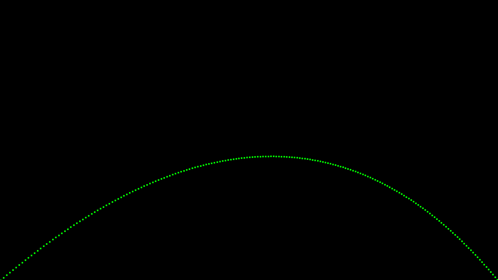
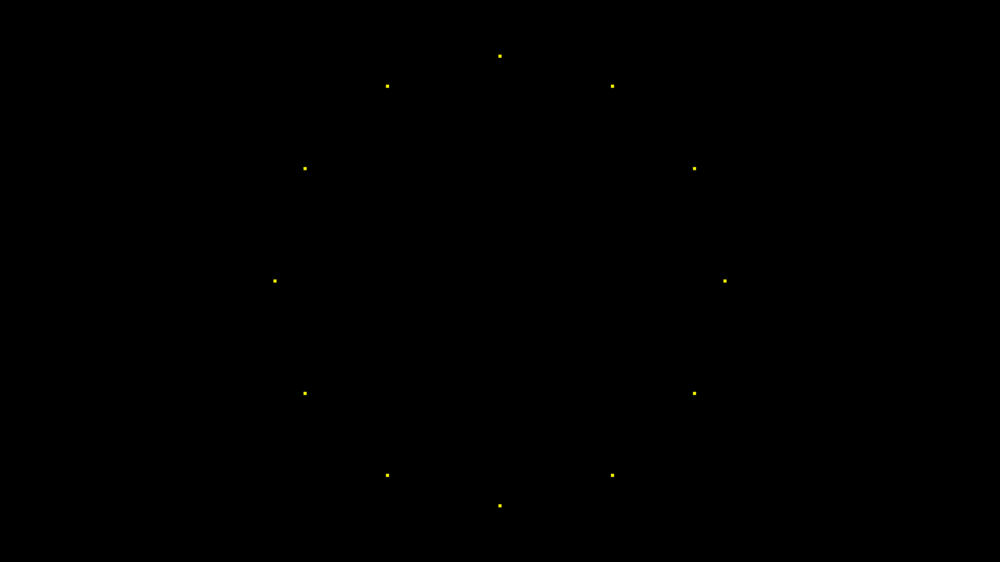
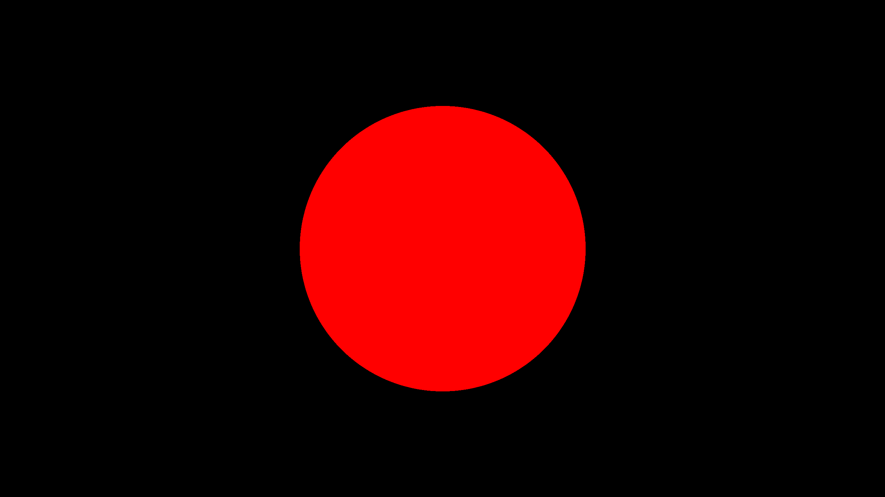
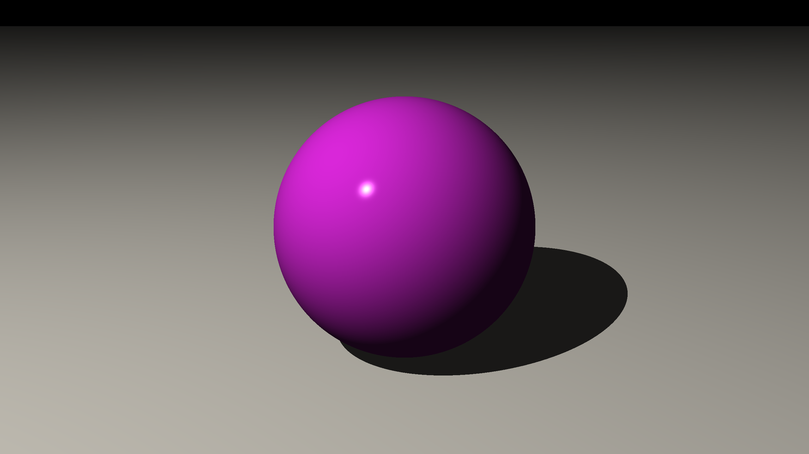
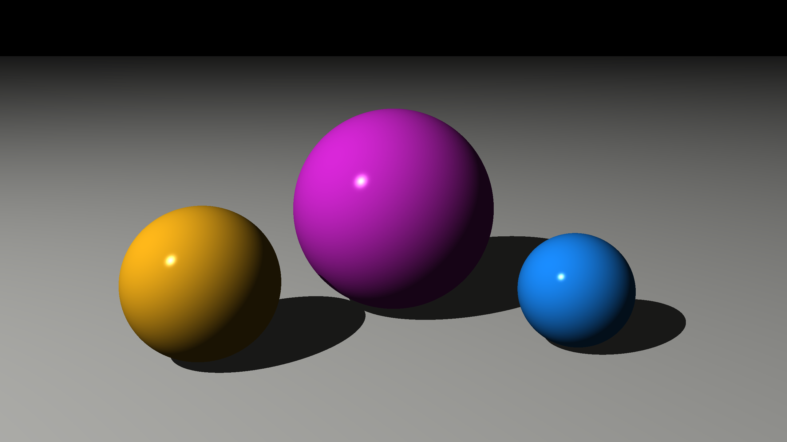
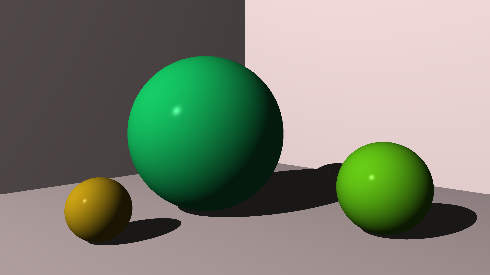

# Renders

This folder contains QHD (2560 × 1440) renders produced by the visualizer programs in [`visualizers/`](../visualizers/).  
Each image is a self-contained demonstration of a specific feature of the ray tracer.

---

## 1 · Project Trajectory

A projectile is launched at an angle under a constant gravity force and a sideways wind force.  
Each tick of the simulation writes a pixel to the canvas, tracing the arc of the trajectory.  
**Concepts:** 2D canvas, vector addition, iterative simulation.

---

## 2 · Clock Markers

Twelve dots are placed at the positions of clock hours by rotating a reference point around the canvas centre using a 2D rotation matrix.  
**Concepts:** 2D rotation transformation, point–matrix multiplication.

---

## 3 · Sphere Ray Cast

A ray is fired from a single origin through every pixel of the canvas toward a sphere.  
Pixels that intersect the sphere are painted red; the rest remain black — producing a sharp silhouette.  
**Concepts:** ray–sphere intersection algorithm, binary hit detection, no lighting.

---

## 4 · Sphere Phong Reflection

A single magenta sphere rests on an infinite floor plane.  
Each pixel's colour is computed with the full **Phong reflection model**: ambient base colour, diffuse shading proportional to the angle of incidence, and a specular highlight pointing back toward the eye.  
**Concepts:** Phong shading, point lights, surface normals, infinite planes, World/Camera pipeline.

---

## 5 · Multiple Sphere Phong Reflections

Three spheres of different sizes and materials are arranged on an infinite floor plane, each shaded independently under a single point light.  
The scene demonstrates that the same Phong pipeline scales to any number of objects with different material parameters.  
**Concepts:** multiple materials, view transform, perspective camera, Phong shading on N objects.

---

## 6 · First Scene

A full 3D scene rendered through a perspective camera.  
Three coloured spheres sit on an infinite floor plane flanked by two angled back walls.  
Shadow rays are cast from every lit surface point toward the light source; occluded points receive only ambient light, creating hard shadows.  
**Concepts:** view transform, perspective projection, infinite planes, hard shadows, shadow-acne prevention (epsilon offset).

---

## 7 · Matrix Transformations

Six spheres are arranged in a line, each transformed by a **different combination** of the three fundamental 4 × 4 matrix operations:

| Sphere | Colour | Transform applied |
|--------|--------|-------------------|
| Far-left | 🔴 Coral | **Translation only** — sphere moved to the left along X |
| Centre-left | 🟢 Teal | **Uniform scale ×1.5** — sphere enlarged equally on all axes |
| Centre | 🟡 Amber | **Non-uniform scale** — squashed on Y into an oblate disc |
| Centre-right | 🟣 Violet | **Rotation around Z** applied to an elongated ellipsoid |
| Top | 🔵 Electric blue | **Combined** translate + rotate + scale, perched above the teal sphere |
| Far-right | 🟠 Orange | **Scale-down ×0.3** — tiny sphere to show relative size |

**Concepts:** translation matrix, uniform & non-uniform scaling, rotation matrices, matrix composition (chained transforms), SoA World layout.
